# 📋 Time Sheet Aggregation & Billing — n8n Implementation Plan

## Overview

This project automates Exist Software Labs' end-to-end billing cycle: from contract ingestion to timesheet collection, validation, invoice generation, approval, and client notification. The system replaces a manual 2-3 day process with an automated pipeline built in **n8n**.

---

## Architecture: Workflows & Subworkflows

The project is split into **4 main workflows** and **3 subworkflows** for modularity, testability, and reuse.

```mermaid
graph TD
    W1["🔵 WF1: Contract Ingestion<br/>(Event-driven)"]
    W2["🟢 WF2: Billing Pipeline<br/>(Daily Schedule + Manual)"]
    W3["🟡 WF3: Discrepancy Resolution<br/>(Webhook-driven)"]
    W4["🔴 WF4: Payment Tracking<br/>(Scheduled)"]

    SW1["⚪ Sub-WF A: Timesheet Collection"]
    SW2["⚪ Sub-WF B: Contract Data Extraction"]
    SW3["⚪ Sub-WF C: Invoice Generation"]

    LOCK["🔒 Processing Lock"]
    AUDIT["📋 Audit Log"]

    W1 -->|"stores contract metadata<br/>+ human_verified flag"| DB[(Contract Registry<br/>Google Sheet)]
    W2 -->|"acquires lock"| LOCK
    W2 -->|"calls"| SW1
    W2 -->|"calls (only if human_verified)"| SW2
    W2 -->|"calls"| SW3
    W2 -->|"if discrepancies"| W3
    W3 -->|"resolved → re-runs"| W2
    W2 -->|"after send"| W4

    W1 -.->|"logs"| AUDIT
    W2 -.->|"logs every step"| AUDIT
    W3 -.->|"logs"| AUDIT
    SW1 -.->|"logs"| AUDIT
    SW2 -.->|"logs"| AUDIT
    SW3 -.->|"logs"| AUDIT
```



---

## Workflow Breakdown

### 🔵 Workflow 1: Contract Ingestion & Extraction (Steps 1 + 4)

| Item | Detail |
|---|---|
| **Trigger** | **Path A:** Google Drive file watcher on `/Contracts/` folder (for BUs that use SOW/CO PDFs) |
| | **Path B:** Manual entry / Google Form (for BUs like BFS that don't use the SOW process) |
| **Covers** | Steps 1 and 4 from the overview |
| **What it does** | Detects or receives contract data → extracts via **Azure OpenAI/Gemini** (Path A) or stores directly (Path B) → stores in **Contract Registry** |
| **Why separate** | Contracts change independently of billing cycles. Extracting on upload means data is always ready when billing runs. |

> [!WARNING]
> **Not all BUs follow the SOW process.** BFS (and potentially others) may not upload contracts to Google Drive. WF1 must support multiple intake paths. A BU survey is required to determine each client’s contract process.

**Path A — SOW/CO PDF from Google Drive (automated):**
1. Google Drive Trigger → filter for SOW/CO filenames
2. Google Drive Download → get PDF binary
3. HTTP Request → Azure OpenAI API (primary) or Gemini (fallback) → PDF → structured JSON
4. Code Node → validate/clean extracted data, **sanity checks** (flag rates >2x or <0.5x average)
5. Code Node → set `human_verified = false`, `confidence_score` from LLM response
6. Google Sheets → upsert row into Contract Registry
7. **Gmail → send verification email** with extracted data table + PDF link + **[✅ Mark as Verified]** webhook button
8. Webhook → receive verification click → set `human_verified = true`, log `verified_by` + `verified_at`
9. Log to Audit Log

**Path B — Manual entry (for BUs without SOW process):**
1. Admin fills a **Google Form** or directly enters contract data into the Contract Registry
2. `human_verified = true` by default (data entered directly by human, not AI-extracted)
3. Log to Audit Log

> [!IMPORTANT]
> **Verification UX:** Instead of manually editing a Google Sheet cell, admins click a webhook button in their email. This logs `verified_by`, `verified_at`, and prevents accidental edits. Contract Registry columns include: `verified_by` (email), `verified_at` (timestamp), `intake_path` (drive_auto / manual_entry).

---

### 🟢 Workflow 2: Billing Pipeline (Steps 2, 3, 5, 6, 7, 8, 10, 11, 12)

The **main orchestrator** with a **dual-trigger** design.

| Item | Detail |
|---|---|
| **Trigger 1** | **Daily Schedule (7 AM)** — auto-detects which clients are due today by checking `Next Billing Date` in the Contract Registry |
| **Trigger 2** | **Manual Trigger** — form with client dropdown for ad-hoc runs, re-processing, or corrections |
| **Covers** | Steps 2–3, 5–8, 10–12 |
| **What it does** | Collects timesheets → validates → loads contract data → extracts hours → runs checks → computes totals → generates invoices → handles approval → sends to client |

**Dual-trigger flow:**
```
[Schedule Trigger: Daily 7AM] → Read Registry → Filter: Next Billing Date <= today (catch-up)
                                                                        ↓
                                                    🔒 Acquire processing lock
                                                                        ↓
                                                              Billing Pipeline
                                                                        ↑
[Manual Trigger: Form w/ client dropdown + status display] ─────────────┘
```

> [!IMPORTANT]
> **Catch-up logic:** Filter uses `<= today` (not `= today`) so missed days are automatically caught up.
> **Processing lock:** **Per-client locks** (not global). Each client has its own `processing_lock` in the Contract Registry. A stuck run for Client A doesn’t block Client B. Max run time: 2 hours per client — auto-release lock on timeout.
> **Manual trigger guardrails:** The form shows the client's current status. If already billed for this period, requires explicit confirmation.

**Per-client billing periods** (stored in Contract Registry):

| Billing Type | Example | Next Date Calculation |
|---|---|---|
| Calendar Month | Jan 1–31 | 1st of next month |
| Mid-month | Jan 15 – Feb 14 | +1 month from start |
| Bi-weekly | Every 14 days | +14 days |
| Custom (N weeks) | Every 4 weeks | +N×7 days |

**Pipeline steps (per client):**
1. **Generate Billing Run ID** (e.g., `BR-2026-02-ABC-001`) → idempotency key
2. **Idempotency check** → if this billing period already has status `INVOICE_SENT`, skip (prevent double-billing)
3. Call **Sub-WF A** (Timesheet Collection) → returns unified timesheet data → **log to Audit**
4. **Schema validation** → verify Sub-WF A returned expected fields
5. Validate & clean data (Step 3) → **log rejections to Audit**
6. Call **Sub-WF B** (Contract Data Extraction) → returns contract terms → **only if `human_verified = true`**
7. Group hours by resource (Step 5)
8. **Run 4 discrepancy checks** (Step 6) → **log findings to Audit**
   - *Rate/Max Hours Check*
   - *Total Hours Reconciliation (Billable + Non-billable = Monthly Available)*
   - *Contract Allocation Check (160 hrs/month limit)*
   - *Monthly Hours Log Check (Overtime requires 30% premium)*
9. **Branch:**
   - ✅ No issues → Compute totals (Step 7) → Call **Sub-WF C** (Invoice Generation)
   - ❌ Issues found → Trigger **Workflow 3** (Discrepancy Resolution), pause this client
10. Approval flow (Step 11) → auto or **webhook-button-based** manual (not email reply parsing)
11. Send to client (Step 12) → Gmail with attachments
    - *Subject:* `Exist Billing ending [billing period]`
    - *Attachments:* Client Billing report, Contract/SOW PDF, Non-billable hours report, Consolidated report
12. Log in Odoo
13. Update billing status to `INVOICE_SENT` + update `Next Billing Date` in Contract Registry
14. **Release per-client processing lock**
15. Set payment reminder
16. **After all clients processed** → send **daily run summary email** (billed / skipped / failed / discrepancies)

---

### ⚪ Sub-Workflow A: Timesheet Collection (Step 2)

| Item | Detail |
|---|---|
| **Called by** | Workflow 2 |
| **Input** | Client name, billing period (start date / end date — varies per client), **client config from Template Registry** |
| **Output** | Unified JSON array of all timesheet entries |

> [!WARNING]
> **Each client has their own timesheet template.** Column names, date formats, row structures, and layouts vary per client. Sub-WF A cannot assume a uniform schema. A **Client Template Registry** is required.

**Client Template Registry** (Google Sheet — one row per client):

| Client | Timesheet Source | Template Type | Field Mapping | Sample File |
|---|---|---|---|---|
| ABC Corp | Google Sheet | Standard internal | `{name: "Col A", date: "Col B", hours: "Col C"}` | [link] |
| XYZ Inc | Client Excel template | Custom | `{name: "Employee", date: "Work Date", hours: "Total Hrs"}` | [link] |
| Acme Co | Client web portal | API/export | TBD | N/A |

**Data Sources (parallel branches, each with 3-retry + exponential backoff):**
1. **JIRA branch** → JIRA API: query worklogs filtered by project/dates → normalize to standard schema
2. **Client-specific template branch** → Read timesheet file (format varies per client) → use **per-client field mapping** from Template Registry → normalize. For unstructured/unusual formats, use **AI-powered dynamic extraction** (Azure OpenAI/Gemini)
3. **Scanned docs branch** → Google Drive: find PDFs/images in client folder → **AI-powered OCR extraction** (Azure OpenAI primary / Gemini fallback) → normalize to standard schema
   - If OCR detects **handwritten** content → flag for **mandatory human review** before proceeding
4. **HRIS branch** → API call to employee.exist.com or Odoo → get official attendance/leave records

**HRIS Cross-Reference (conflict resolution hierarchy):**
- HRIS is **authoritative for attendance status** (present / absent / leave type)
- JIRA/Sheets are **authoritative for task/activity details**
- **If HRIS says "leave" but JIRA has logged hours** → flag as `HRIS_CONFLICT` discrepancy (do NOT silently use either value)
- **Leave type → billing mapping** (from configuration):

| Leave Type | Billing Category |
|---|---|
| Sick Leave | Non-billable |
| Vacation | Non-billable |
| Client Holiday | Non-billable |
| Work From Home | Billable |
| Unpaid Leave | Non-billable |

**Merge** → deduplicate → HRIS cross-reference → standardize names/dates → **schema validation** on output → **log collection summary to Audit** → return unified dataset

> [!IMPORTANT]
> **Retry strategy:** Each API branch has n8n retry (3 attempts, exponential backoff). If a source still fails, log the error and **continue with available sources** rather than aborting the entire run.
> **LLM cost guard:** OCR/AI extraction branches count LLM calls. If >20 per billing run, pauses and notifies admin.
> **Handwritten timesheets:** Always flagged for human verification. Workflow pauses until human confirms the OCR output.

---

### ⚪ Sub-Workflow B: Contract Data Extraction (Step 4)

| Item | Detail |
|---|---|
| **Called by** | Workflow 2 |
| **Input** | Client name (to look up in Contract Registry) |
| **Output** | Structured contract JSON (resources, rates, max hours, VAT, overtime terms) |

**Logic:**
1. Look up client in Contract Registry (Google Sheet)
2. **Check `human_verified` flag** — if `false`, abort and notify admin (cannot bill with unverified data)
3. If data exists, is recent, and is verified → return cached data
4. If not → download PDF from Google Drive → Azure OpenAI/Gemini extraction → store → mark `human_verified = false` → return (will require verification before billing)

> This subworkflow can also be called directly by Workflow 1 during contract ingestion.
> **Schema validation** on output: ensures all required fields (resources, rates, currency, VAT terms) are present.

---

### ⚪ Sub-Workflow C: Invoice Generation (Steps 8, 10)

| Item | Detail |
|---|---|
| **Called by** | Workflow 2 |
| **Input** | Billing computation data (line items, totals, VAT, client info) + mode ("draft" or "final") |
| **Output** | Google Drive link to generated PDF |

**Logic:**
1. Copy Google Docs billing template
2. Replace all `{{placeholders}}` with actual data
3. If mode = "final" → add invoice number, signature, "FINAL" watermark
4. Export as PDF
5. Save to appropriate Google Drive folder (`/Billing/Drafts/` or `/Billing/Final/`)
6. Return link

---

### 🟡 Workflow 3: Discrepancy Resolution (Step 9)

| Item | Detail |
|---|---|
| **Trigger** | Called from Workflow 2 (or Webhook for AM response) |
| **What it does** | Sends discrepancy report to Account Manager → waits for resolution → triggers re-run |

**Flow:**
1. Receive discrepancy data (resource, issue type, details)
2. Gmail → send notification to Account Manager with links to timesheet + contract
3. Webhook → wait for AM to mark as "resolved" — **with 48-hour timeout**
4. **Timeout escalation:**
   - After 48 hrs → send **reminder email** to AM
   - After 96 hrs → **escalate** to manager
   - After 144 hrs → auto-flag as "billing delayed", log to Audit, move on
5. Once resolved → trigger Workflow 2 re-run for that specific client
6. Log resolution details to Audit

> [!WARNING]
> **Without timeouts**, webhooks can hang indefinitely in n8n's execution queue, consuming resources. The 3-tier escalation ensures nothing slips through the cracks.

---

### 🔴 Workflow 4: Payment Tracking & Reminders (Future Phase)

| Item | Detail |
|---|---|
| **Trigger** | Schedule (daily check) |
| **What it does** | Checks for overdue invoices → sends reminder emails to clients |

**Flow:**
1. Read sent invoices log (Google Sheet or Odoo)
2. Filter for unpaid + past due date
3. Send tiered reminders (5 days before, on due date, 7 days after)

---

## Implementation Phases

Robustness is built into every phase — not deferred to the end.

### Phase 1 — Foundation, Contract Ingestion & Odoo
- Create Contract Registry (Google Sheet) w/ multi-currency fields + `human_verified`, `confidence_score`, `billing_status`, `processing_lock` columns
- Create Audit Log (Google Sheet)
- Build **Workflow 1** (Contract Ingestion) using Azure OpenAI (GPT) w/ Gemini fallback
- Build **Sub-WF B** (Contract Data Extraction) w/ human verification gate
- Build sanity checks for extracted rates
- Set up Odoo API integration (required from Phase 1)
- Test with sample SOW PDFs
- ✅ **Robustness in this phase:** human verification flag, confidence scoring, sanity checks, audit logging

### Phase 2 — Timesheet Collection & Validation
- Build **Sub-WF A** (Timesheet Collection) w/ 4 data source branches
- Add retry logic (3 retries, exponential backoff) per API branch
- Add graceful degradation (continue with available sources if one fails)
- Add OCR extraction for scanned timesheets w/ handwritten detection + human review gate
- Add LLM cost guard (max 20 calls per billing run)
- Build validation logic (Step 3) w/ Philippine holiday API
- Build schema validation on subworkflow inputs/outputs
- Handle variable billing periods per client
- Test with dummy timesheet data
- ✅ **Robustness in this phase:** retry strategy, graceful degradation, cost guards, schema validation, human review for handwritten docs

### Phase 3 — Billing Computation & Invoice Generation
- Build discrepancy checks (Step 6) in Workflow 2
- Build billing computation (Step 7) w/ multi-currency support
- Build idempotency check (billing run ID + status tracking to prevent double-billing)
- Build processing lock (prevent concurrent runs)
- Build catch-up logic (`<= today` filter)
- Build manual trigger guardrails (status display + re-run confirmation)
- Create Google Docs billing template (pending from HR)
- Build **Sub-WF C** (Invoice Generation) w/ image stamp signature
- Test end-to-end with dummy data
- ✅ **Robustness in this phase:** idempotency, processing lock, catch-up logic, manual trigger guardrails

### Phase 4 — Notifications, Approvals & Delivery
- Build **Workflow 3** (Discrepancy Resolution) w/ 48hr timeout + 3-tier escalation
- Build approval flow (email reply based)
- Build client email delivery (Gmail + attachments)
- Log invoices in Odoo
- Test full cycle
- ✅ **Robustness in this phase:** webhook timeouts, escalation chain

### Phase 5 — Polish & Production
- Comprehensive error handling review across all workflows
- Audit Log review and reporting
- Build **Workflow 4** (Payment Tracking) — *optional*
- Production testing with real (redacted) data
- Handoff & documentation

---

## 🛡️ Robustness & Best Practices Summary

Every pattern below is integrated into the workflows above — this is a quick-reference.

| # | Pattern | Where | Why |
|---|---|---|---|
| 1 | **Idempotency** — Billing Run ID + status check | WF2 | Prevents double-billing on re-runs |
| 2 | **Human verification gate** — `human_verified` flag on contracts | WF1, Sub-WF B | Prevents billing with AI-hallucinated rates |
| 3 | **Catch-up logic** — `<= today` filter | WF2 trigger | Missed billing days auto-recover |
| 4 | **Processing lock** — `processing_in_progress` flag | WF2 | Prevents concurrent runs corrupting data |
| 5 | **Webhook timeouts + escalation** — 48hr / 96hr / 144hr | WF3 | Prevents workflows from hanging forever |
| 6 | **Audit trail** — Every step logged with timestamps | All | Full traceability for billing disputes |
| 7 | **Schema validation** — Validate subworkflow I/O | All subworkflows | Catches breaking changes between workflow updates |
| 8 | **LLM cost guard** — Max 20 OCR calls per run | Sub-WF A | Prevents surprise API bills |
| 9 | **Manual trigger guardrails** — Status display + confirmation | WF2 | Prevents accidental re-billing |
| 10 | **Retry + graceful degradation** — 3 retries, continue on partial failure | Sub-WF A | One API down doesn't block the entire billing run |

---

## Questions for You (Need Answers Before Starting)

> [!IMPORTANT]
> These questions will shape the implementation. Please answer before I proceed.

### Infrastructure & Setup
1. **n8n setup** — Are you using n8n Cloud or self-hosted? What version? self hosted.
2. **Credentials** — Which of these do you already have set up as n8n credentials?
   - [ ] Google OAuth (Drive, Sheets, Docs, Gmail) yes
   - [ ] JIRA API token, not yet
   - [ ] Claude API key (Anthropic), i will use either gemini or azure open ai api
   - [ ] HRIS/Odoo API access, nont yet
3. **Google Drive** — Does the folder structure (`/Contracts/`, `/Timesheets/`, `/Billing/`) already exist? yes

### Data Sources
4. **HRIS system** — Is this Odoo directly, or a separate system (employee.exist.com)? Is there an API we can call? yes there is an api
5. **Scanned timesheets** — For scanned PDFs/images, do you want AI-powered OCR extraction now, or just storage (with manual processing) for now? yes, ocr extraction
6. **JIRA** — Is this Jira Cloud or Jira Server/Data Center? cloud.

### Billing & Templates
7. **Google Docs template** — Do you already have a billing statement template, or should I design one? none yet, i will ask it from hr
8. **Invoice numbering** — What's your numbering convention? (e.g., `INV-2024-001`, `ESL-ABC-2024-01`) i will ask hr
9. **Digital signature** — Preference? (Image stamp is simplest, DocuSign is most professional) image stamp
10. **Currency** — Is it always USD, or does it vary by client? it varies by client

### Scale & Process
11. **Client volume** — How many clients do you process per billing cycle? 10
12. **Processing mode** — Do you want all clients processed in one batch, or one at a time? one at a time
13. **Billing period** — Always calendar month? Or do some clients have different billing periods? have different billing periods.

### Approvals
14. **Approval channel** — For final approval (Step 11), do you prefer: Email reply, Slack button, or simple web form? email reply
15. **Auto-approval threshold** — The overview mentions $20,000. Is that the right threshold? i will have to ask hr.

### Integrations
16. **Odoo** — Is Odoo integration required from Phase 1, or can it be added later? yes.
17. **Holiday calendar** — Philippine holidays? Do you have a list, or should we use a holiday API? use holiday api.

### Deliverables
18. **n8n workflow JSON** — Do you want me to generate exportable `.json` workflow files you can import into n8n directly? no, use the n8n workflows i will attach to you. i have not created/attached one yet.
19. **Test data** — Do you have sample/dummy SOW PDFs and timesheet data, or should I create test fixtures? i will provide you with sample/dummy SOW PDFs and timesheet data soon, but just use/create dummy for now

---

## What I Will Deliver

I will work within your existing n8n workflows (once you attach them). For each workflow/subworkflow:
- **Code Node JavaScript** files (all custom logic, ready to paste)
- **Configuration guide** (credentials, settings, node configuration)
- **Google Docs template** content (for invoice generation, once HR provides theirs)
- **Testing guide** with dummy data
- **Architecture diagram** (Mermaid)
- **LLM prompt templates** for contract extraction and OCR (Gemini/Azure OpenAI compatible)

---

## Verification Plan

### Automated Testing
- Create dummy test data (SOW PDFs, timesheet CSVs/JSON) for each workflow
- Test each subworkflow independently with known inputs → verify outputs
- Test the full billing pipeline end-to-end with a synthetic "ABC Corp" scenario
- Verify discrepancy detection catches known edge cases (overtime, missing hours, wrong rates)
- Verify billing math (hours × rates + VAT) against manual calculations

### Manual Testing (by you)
- Import workflows into n8n and verify they render correctly
- Configure credentials and test API connectivity
- Run with real (redacted) contract PDF → verify Gemini/Azure OpenAI extraction accuracy
- Run full cycle → verify generated invoice PDF looks correct
- Test approval flow (email/webhook response)
- Test discrepancy notification email format
